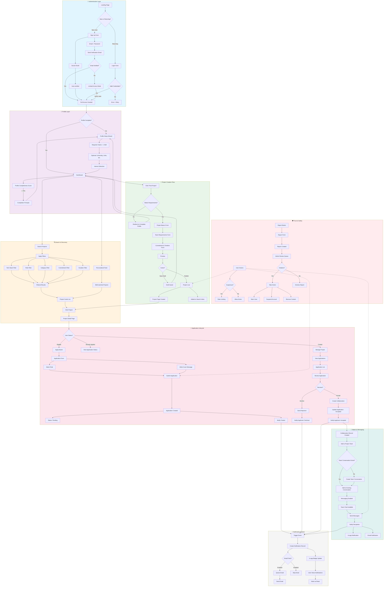

# 🎓 Collabers — Product Design Document
## *"Find your project partner.  Build something together."*

**Version:** 1.0  
**Last Updated:** 2025-12-14  
**Status:** Draft  

---

## Table of Contents

1. [Overview](#1-overview)
2. [High-Level Product Architecture](#2-high-level-product-architecture)
3. [User Workflows](#3-user-workflows)
4. [System Workflow Diagram](#4-system-workflow-diagram)
5. [Feature Prioritization](#5-feature-prioritization)
6. [Anti-Patterns to Avoid](#6-anti-patterns-to-avoid)
7. [Design Principles](#7-design-principles)

---

## 1. Overview

### 1.1 What Is Collabers? 

Collabers is a web platform for university students to find project partners, similar in concept to freelancer.com and job boards, but focused on **student-to-student collaboration** for: 

- Personal projects
- Hackathons
- Coursework
- Startup ideas
- Open source contributions

### 1.2 Key Constraints

| Constraint | Description |
|------------|-------------|
| **Team Size** | Solo developer or very small team |
| **No . edu Verification** | Any email allowed; no university email requirement |
| **Trust Model** | Profile transparency and social signals instead of institutional verification |
| **Technology Agnostic** | Design is independent of specific tech stack |

### 1.3 Core Value Proposition

> *"Find the right people to build with — whether it's a weekend hackathon or your next startup."*

- **For Project Creators:** Post your idea, find skilled collaborators, build your team
- **For Applicants:** Discover exciting projects, apply with your skills, join teams

---

## 2. High-Level Product Architecture

### 2.1 Core Entities

#### **User**

| Attribute | Description |
|-----------|-------------|
| `id` | Unique identifier |
| `email` | Login credential (any email allowed) |
| `password_hash` | Secure credential storage |
| `email_verified` | Boolean — required for full platform access |
| `created_at` | Account creation timestamp |
| `last_active` | Activity tracking for trust signals |
| `account_status` | `active`, `suspended`, `deactivated` |

**Responsibility:** Authentication, account state management, session handling. 

---

#### **Profile**

| Attribute | Description |
|-----------|-------------|
| `user_id` | Foreign key to User |
| `display_name` | Public name or alias |
| `avatar_url` | Profile image |
| `university` | Free-text, optional |
| `major` | Field of study |
| `graduation_year` | Expected graduation |
| `bio` | Short personal description |
| `skills` | Array of skill tags |
| `tech_stack` | Array of technologies |
| `preferred_roles` | Array: `frontend`, `backend`, `design`, `ML`, `PM`, etc. |
| `availability` | `actively_looking`, `open_to_offers`, `not_available` |
| `hours_per_week` | Availability commitment |
| `timezone` | For coordination |
| `links` | Object:  `{ github, linkedin, portfolio, other }` |
| `profile_completeness` | Percentage score (trust signal) |

**Responsibility:** Public identity, discoverability, skill representation, trust signals through transparency.

---

#### **ProjectPost**

| Attribute | Description |
|-----------|-------------|
| `id` | Unique identifier |
| `creator_id` | Foreign key to User |
| `title` | Project name |
| `description` | Rich text description |
| `category` | Enum: `coursework`, `hackathon`, `startup`, `learning`, `open_source` |
| `required_tech_stack` | Array of technologies |
| `desired_roles` | Array of roles needed |
| `commitment_hours` | Hours/week expected |
| `duration` | Enum: `< 1 month`, `1-3 months`, `3-6 months`, `ongoing` |
| `team_size_needed` | Number of collaborators needed |
| `status` | `draft`, `open`, `in_progress`, `filled`, `completed`, `cancelled` |
| `visibility` | `public`, `unlisted` |
| `created_at` | Posting timestamp |
| `deadline` | Application deadline (optional) |
| `views_count` | Engagement metric |

**Responsibility:** Project representation, discoverability, matching criteria, lifecycle management.

---

#### **Application**

| Attribute | Description |
|-----------|-------------|
| `id` | Unique identifier |
| `project_id` | Foreign key to ProjectPost |
| `applicant_id` | Foreign key to User |
| `role_applied_for` | Which role they're interested in |
| `cover_message` | Why they want to join |
| `status` | `pending`, `viewed`, `accepted`, `rejected`, `withdrawn` |
| `created_at` | Application timestamp |
| `responded_at` | When creator responded |

**Responsibility:** Intent expression, role matching, application lifecycle, conversion tracking.

---

#### **Collaboration (Match)**

| Attribute | Description |
|-----------|-------------|
| `id` | Unique identifier |
| `project_id` | Foreign key to ProjectPost |
| `collaborator_id` | Foreign key to User |
| `role` | Assigned role |
| `status` | `active`, `completed`, `left`, `removed` |
| `joined_at` | When collaboration started |
| `ended_at` | When collaboration ended (if applicable) |

**Responsibility:** Active team membership, role tracking, collaboration history for trust building.

---

#### **Conversation**

| Attribute | Description |
|-----------|-------------|
| `id` | Unique identifier |
| `project_id` | Context of the conversation (optional) |
| `participant_ids` | Array of User IDs |
| `type` | `application_discussion`, `team_chat`, `direct` |
| `created_at` | Conversation start |
| `last_message_at` | For sorting |

**Responsibility:** Communication container, access control, context preservation.

---

#### **Message**

| Attribute | Description |
|-----------|-------------|
| `id` | Unique identifier |
| `conversation_id` | Foreign key to Conversation |
| `sender_id` | Foreign key to User |
| `content` | Message text |
| `created_at` | Timestamp |
| `read_by` | Array of User IDs who have read |

**Responsibility:** Communication content, read receipts, message history. 

---

#### **Notification**

| Attribute | Description |
|-----------|-------------|
| `id` | Unique identifier |
| `user_id` | Recipient |
| `type` | `new_application`, `application_accepted`, `application_rejected`, `new_message`, `project_update` |
| `reference_type` | `project`, `application`, `message` |
| `reference_id` | ID of related entity |
| `read` | Boolean |
| `created_at` | Timestamp |

**Responsibility:** User engagement, timely alerts, action prompts.

---

#### **Review** (Phase 2)

| Attribute | Description |
|-----------|-------------|
| `id` | Unique identifier |
| `collaboration_id` | Foreign key to Collaboration |
| `reviewer_id` | Who wrote the review |
| `reviewee_id` | Who is being reviewed |
| `rating` | 1-5 stars |
| `content` | Written feedback |
| `tags` | `reliable`, `skilled`, `communicative`, `creative` |

**Responsibility:** Trust building, reputation system, quality signal for future matching.

---

#### **Report**

| Attribute | Description |
|-----------|-------------|
| `id` | Unique identifier |
| `reporter_id` | Who filed the report |
| `reported_user_id` | Offending user (optional) |
| `reported_project_id` | Offending project (optional) |
| `reason` | Enum: `spam`, `harassment`, `fake_profile`, `inappropriate_content`, `other` |
| `details` | Free-text explanation |
| `status` | `pending`, `reviewed`, `resolved`, `dismissed` |

**Responsibility:** Trust & safety, community moderation, abuse prevention.

---

### 2.2 Entity Relationship Summary

```
┌─────────────────────────────────────────────────────────────────────┐
│                                                                     │
│    User ──────┬──────── Profile (1:1)                               │
│       │       │                                                     │
│       │       └──────── ProjectPost (1:many) ◄─────┐                │
│       │                      │                      │               │
│       │                      ▼                      │               │
│       └──────────────► Application (many) ──────────┘               │
│       │                      │                                      │
│       │                      ▼                                      │
│       │               Collaboration (Match)                         │
│       │                      │                                      │
│       └──────────────► Conversation ◄───────────────┘               │
│       │                      │                                      │
│       │                      ▼                                      │
│       │                   Message                                   │
│       │                                                             │
│       └──────────────► Notification                                 │
│       │                                                             │
│       └──────────────► Review (gives & receives)                    │
│       │                                                             │
│       └──────────────► Report                                       │
│                                                                     │
└─────────────────────────────────────────────────────────────────────┘
```

---

## 3. User Workflows

### 3.1 Workflow A: New User Onboarding

**Goal:** Get a new user from zero to discoverable with minimal friction.

#### Step 1: Landing & Sign Up

- User lands on homepage
- Sees value prop: "Find project partners for hackathons, coursework, and startup ideas"
- Clicks "Get Started" or "Sign Up"
- Enters email + password (any email accepted)
- Alternative: Social sign-in (Google, GitHub)

#### Step 2: Email Verification

- System sends verification email
- User clicks link → email confirmed
- If social sign-in: auto-verified
- User redirected to profile setup

> ⚠️ **Unverified users can browse but cannot:**
> - Post projects
> - Apply to projects
> - Send messages

#### Step 3: Profile Creation (Progressive)

**Required fields (to proceed):**
- Display name
- At least 1 skill

**Optional fields (shown with "complete your profile" prompt):**
- University (free-text with autocomplete from existing entries)
- Major / field
- Graduation year
- Tech stack (multi-select with search)
- Preferred roles
- Availability status
- Hours/week
- Bio
- Links (GitHub, LinkedIn, portfolio)

> 📊 **Profile completeness meter shown:**
> "Your profile is 40% complete. Complete profiles get 3x more project invitations."

#### Step 4: Interest Selection

- "What brings you here?" (multi-select)
  - □ Find partners for coursework
  - □ Join hackathon teams
  - □ Work on personal/learning projects
  - □ Find co-founders for startup ideas
  - □ Contribute to open source
  - □ Post a project I'm working on

→ Used for personalized feed and recommendations

#### Step 5: Dashboard / Home

- Personalized project feed based on: 
  - Skills match
  - Preferred roles match
  - Interest categories
- Prompt to post first project OR explore projects
- Profile completion reminder if < 70%

---

### 3.2 Workflow B: Posting a Project

**Goal:** Enable project creators to clearly describe what they're building and who they need. 

#### Step 1:  Initiate Project Creation

- User clicks "Post a Project" from dashboard or header
- Prerequisite check: 
  - ✓ Email verified
  - ✓ Profile has display name + at least 1 skill
- If not met → redirect to complete requirements

#### Step 2: Project Basics

**Required:**
- Project title (max 100 chars)
- Category:  Coursework / Hackathon / Startup / Learning / Open Source
- Short description (max 500 chars) — appears in listings

**Optional:**
- Detailed description (rich text, longer form)
- Project links (repo, design doc, etc.)

#### Step 3: Team Requirements

**Required:**
- Roles needed (multi-select): Frontend / Backend / Full-stack / Mobile / ML-AI / Data / DevOps / Designer / PM / Writer / Other
- Team size needed (number picker:  1-10+)

**Optional:**
- Required tech stack (searchable multi-select)
- Nice-to-have skills

#### Step 4: Commitment & Timeline

**Required:**
- Commitment level:  < 5 hrs/week / 5-10 hrs / 10-20 hrs / 20+ hrs
- Duration: < 1 month / 1-3 months / 3-6 months / Ongoing

**Optional:**
- Start date
- Application deadline
- Specific timeline notes

#### Step 5: Preview & Publish

- Show full preview of how listing will appear
- Options: 
  - **[Save as Draft]** — saves but doesn't publish
  - **[Publish]** — makes visible to all users

- Post-publish: 
  - Redirect to project page
  - Show share options (copy link, share to social)
  - "Your project is now live!  You'll be notified when people apply"

---

### 3.3 Workflow C: Applying to a Project

**Goal:** Low-friction application process that still provides meaningful signal to project creators.

#### Step 1: Discover Project

User finds project via:
- Personalized home feed
- Search with filters
- Direct link shared externally
- "Projects looking for [your skills]" section

#### Step 2: View Project Details

Project page shows:
- Full description
- Creator profile snippet (with link to full profile)
- Tech stack, roles needed
- Commitment & timeline
- Current team members (if any already joined)
- Compatibility indicator:  "Your skills match 4/5 requirements"
- **[Apply to This Project]** button
- **[Save for Later]** bookmark

#### Step 3: Application Form

**Required:**
- Select role applying for (from project's listed roles)
- Cover message (min 50 chars): "Tell [Creator Name] why you're interested and what you'd bring"
  - Prompt suggestions shown based on project type

**Auto-attached:**
- Applicant's full profile
- Relevant links (GitHub, portfolio)

**Optional:**
- Highlight specific past project/experience
- Custom availability note

#### Step 4: Submission

- **[Submit Application]**
- Confirmation shown:  "Application sent! You'll be notified when [Creator Name] responds."
- Application appears in "My Applications" with status:  Pending
- Creator receives notification (in-app + email if enabled)

---

### 3.4 Workflow D: Review → Accept → Match → Messaging

**Goal:** Enable project creators to efficiently review applications and transition accepted applicants into collaborators.

#### Step 1: Creator Receives Applications

- Notification: "New application from [Name] for [Project]"
- Dashboard shows: "3 new applications" badge
- Project page shows applications tab with count

#### Step 2: Review Applications

**Application list view shows:**
- Applicant name + avatar
- Role applied for
- Skill match score
- Profile completeness indicator
- Application timestamp
- Status: New / Viewed / Pending Decision

**Click to expand:**
- Full cover message
- Complete applicant profile
- Links (GitHub, portfolio, LinkedIn)
- Past collaborations + reviews (if any)

#### Step 3: Decision Actions

For each application, creator can: 

**[Accept]** → Moves to Step 4
- Optional: Add a welcome message

**[Decline]** → Ends this flow
- Optional: Select reason (not a fit / filled / other)
- Optional: Add a message
- Applicant notified:  "Your application to [Project] was declined"

**[Message First]** → Opens limited conversation (Phase 2)
- For clarifying questions before decision

#### Step 4: Match Created

**System actions:**
- Create Collaboration record (project + user + role)
- Update Application status → Accepted
- Add applicant to project team
- Create Conversation for project team (if not exists)
- Add new member to team conversation

**Notifications:**
- Applicant:  "🎉 You've been accepted to [Project]!"
  - CTA: [Start Chatting] [View Project]
- Creator: "You've added [Name] to [Project]"

#### Step 5: Messaging Enabled

**Team conversation features:**
- All team members can message
- Project context shown at top of conversation
- File/link sharing
- Message history preserved

**Access control:**
- Only accepted collaborators can participate
- Left/removed members lose access but history preserved

**Project page now shows:**
- Team roster with roles
- Updated "X of Y roles filled"
- For outsiders: "Team forming" indicator

---

## 4. System Workflow Diagram



---

## 5. Feature Prioritization

### 5.1 MVP Features (Phase 1) — Must-Have for Launch

#### Authentication & Identity

| Feature | Rationale |
|---------|-----------|
| Email + password sign-up | Core access mechanism |
| Email verification | Spam prevention, basic trust |
| Social OAuth (Google, GitHub) | Reduces friction for students |
| Password reset flow | Basic account recovery |

#### Profile

| Feature | Rationale |
|---------|-----------|
| Display name | Identity without requiring real name |
| Skills selection (tags) | Core matching criteria |
| Tech stack selection | Essential for project matching |
| Preferred roles | Defines what user can contribute |
| University (free-text, optional) | Social signal without verification |
| External links (GitHub, LinkedIn, portfolio) | Trust through transparency |
| Profile completeness indicator | Encourages full profiles |
| Availability status | Signals to project creators |

#### Project Posting

| Feature | Rationale |
|---------|-----------|
| Project title + description | Core project representation |
| Category selection | Enables filtering |
| Required roles | Defines who to recruit |
| Tech stack requirements | Match with applicants |
| Commitment hours/week | Sets expectations |
| Duration estimate | Scope clarity |
| Draft vs. publish status | Flexibility for creators |
| Edit/update project | Iterate on listings |
| Close/mark as filled | Lifecycle management |

#### Discovery & Search

| Feature | Rationale |
|---------|-----------|
| Project listing/feed | Core discovery |
| Filter by tech stack | Find relevant projects |
| Filter by role needed | Match skills to needs |
| Filter by category | Find project type |
| Filter by commitment level | Match availability |
| Filter by duration | Time-based filtering |
| Text search | Direct lookup |
| Sort by:  newest, relevance | Discovery flexibility |

#### Applications

| Feature | Rationale |
|---------|-----------|
| Apply to project | Core workflow |
| Select role applying for | Role-specific applications |
| Cover message | Personalized pitch |
| View application status | Applicant awareness |
| Withdraw application | User control |
| View applicants (creator) | Review pipeline |
| Accept/decline applications | Decision mechanism |

#### Matching & Messaging

| Feature | Rationale |
|---------|-----------|
| Collaboration record on accept | Team formation |
| Team conversation (unlocked on accept) | Gated communication |
| Basic messaging | Coordination capability |
| Unread indicators | Engagement signals |

#### Notifications

| Feature | Rationale |
|---------|-----------|
| In-app notifications | Real-time awareness |
| Email notifications (configurable) | Reach users off-platform |
| New application notification | Creator awareness |
| Application response notification | Applicant awareness |
| New message notification | Communication loop |

#### Trust & Safety (MVP)

| Feature | Rationale |
|---------|-----------|
| Report user/project | Abuse prevention |
| Basic rate limiting | Spam prevention |
| Profile transparency (links visible) | Trust through openness |
| Email verification required for actions | Bot prevention |

---

### 5.2 Phase 2 Features — Nice-to-Have / Post-Launch

#### Enhanced Trust & Reputation

| Feature | Rationale |
|---------|-----------|
| Collaboration reviews/ratings | Build reputation over time |
| "Completed projects" counter | Track record visibility |
| Profile badges | Gamification + trust signals |
| Verified links (GitHub integration) | Prove ownership |
| Response rate/time display | Reliability signal |
| "Active in last week" indicator | Liveness signal |

#### Advanced Discovery

| Feature | Rationale |
|---------|-----------|
| Skill-based project recommendations | Proactive matching |
| "People looking for your tech stack" | Reverse matching |
| Saved searches | Repeat discovery |
| Project bookmarking | Save for later |
| "Similar projects" suggestions | Discovery expansion |
| University-based discovery | Cohort matching |

#### Enhanced Communication

| Feature | Rationale |
|---------|-----------|
| Pre-accept "Q&A" messaging | Clarify before committing |
| File/image sharing in messages | Richer coordination |
| Team announcements | Broadcast updates |
| Read receipts | Communication clarity |
| Typing indicators | Real-time feel |

#### Project Management Lite

| Feature | Rationale |
|---------|-----------|
| Team roster management | See who's on team |
| Role reassignment | Flexibility |
| Remove team member | Handle departures |
| Project milestones/status | Progress tracking |
| Project completion celebration | Positive endings |

#### User Engagement

| Feature | Rationale |
|---------|-----------|
| Skill endorsements | Peer validation |
| Portfolio/project showcase | Past work visibility |
| Activity feed | Community feel |
| Weekly digest emails | Re-engagement |
| "People you may want to work with" | Network expansion |

#### Platform Growth

| Feature | Rationale |
|---------|-----------|
| Invite friends | Viral loops |
| Share project to social media | External traffic |
| Public project pages (SEO) | Search engine discovery |
| Hackathon calendar integration | Event-driven usage |
| University ambassador program | Campus-level growth |

#### Moderation & Admin

| Feature | Rationale |
|---------|-----------|
| Admin dashboard | Platform oversight |
| Automated spam detection | Scale moderation |
| Content moderation queue | Review flagged items |
| User suspension/ban flows | Handle bad actors |
| Appeal process | Fair moderation |

---

## 6. Anti-Patterns to Avoid

### 6.1 Trust & Safety Anti-Patterns

| Anti-Pattern | Why It Hurts | What to Do Instead |
|--------------|--------------|---------------------|
| **Requiring . edu email verification** | Excludes international students, bootcamp grads, career changers; high friction | Use profile transparency, social links, and reputation systems |
| **Anonymous profiles** | Zero accountability leads to spam, ghosting, and low-quality interactions | Require minimum profile completion; show profile completeness to others |
| **No email verification at all** | Bots and throwaway accounts flood the platform | Require email verification for posting, applying, messaging |
| **Hiding user activity signals** | Can't tell if user is active or abandoned account | Show "last active" or "joined date"; show response rate |
| **No reporting mechanism** | Bad actors face no consequences | Simple report flow + clear review process |

---

### 6.2 Onboarding Anti-Patterns

| Anti-Pattern | Why It Hurts | What to Do Instead |
|--------------|--------------|---------------------|
| **Mandatory 20-field profile form** | Users abandon before finishing; feels like a job application | Progressive disclosure:  minimum to start, prompt to complete later |
| **Asking for info you won't use** | Wastes time, erodes trust, adds friction | Only ask for fields that power features (matching, filtering, trust) |
| **No immediate value after sign-up** | Users don't see why they should complete profile | Show personalized project feed immediately; demonstrate value fast |
| **Vague value proposition** | Users don't understand what they'll get | Clear "Find project partners for hackathons, coursework, startups" |
| **Forcing interests before showing content** | Feels like a gate, not a benefit | Let users browse first; ask interests after they see value |

---

### 6.3 Project Posting Anti-Patterns

| Anti-Pattern | Why It Hurts | What to Do Instead |
|--------------|--------------|---------------------|
| **Allowing zero-description posts** | Low-quality listings, wastes applicant time | Require meaningful title + description with minimums |
| **No structured fields (roles, stack)** | Can't filter or match effectively | Required structured fields + free-text for nuance |
| **No way to close/fill projects** | Stale listings everywhere, search results polluted | Clear status:  open, in-progress, filled, completed, cancelled |
| **Allowing same user to post 50 projects** | Spam, low-quality flooding | Rate limits; mark inactive projects automatically |
| **No preview before publish** | Mistakes go live, editing friction | Always show preview; allow drafts |

---

### 6.4 Discovery Anti-Patterns

| Anti-Pattern | Why It Hurts | What to Do Instead |
|--------------|--------------|---------------------|
| **Only chronological feed** | Mismatch between user skills and shown projects | Personalized feed based on skills + roles + interests |
| **No filters** | Users can't find relevant projects | Full filtering:  tech stack, role, category, commitment, duration |
| **Showing inactive/stale projects** | Frustrating dead ends | Prioritize recent/active; hide or deprioritize stale listings |
| **No indication of competition** | User applies to project with 50 applicants | Show "12 applications" or "few applicants" signals |
| **No skill matching indicators** | Can't quickly assess fit | Show "You match 4/5 skills" type indicators |

---

### 6.5 Application Flow Anti-Patterns

| Anti-Pattern | Why It Hurts | What to Do Instead |
|--------------|--------------|---------------------|
| **One-click apply with no context** | Low-quality applications; no signal for creator | Require minimum cover message explaining interest/fit |
| **Essay-length required application** | High friction kills apply rate | Short required message (50-200 chars); optional details |
| **No application status visibility** | Applicants left in the dark, anxiety, repeat applications | Clear status: pending, viewed, accepted, declined |
| **No way to withdraw application** | User stuck if circumstances change | Allow withdraw before response |
| **No notification to creator** | Creator doesn't know to check | Immediate notification on new application |
| **Silent rejections (no notification)** | Applicant waits forever, bad experience | Always notify on decision (even if declined) |

---

### 6.6 Matching & Messaging Anti-Patterns

| Anti-Pattern | Why It Hurts | What to Do Instead |
|--------------|--------------|---------------------|
| **Allow anyone to message anyone** | Spam, cold outreach fatigue, harassment vector | Gate messaging behind acceptance; protect users' inboxes |
| **No context in conversations** | Lose track of what project this relates to | Always show project context in conversation header |
| **No notification for messages** | Messages go unseen, conversations die | In-app + email notifications for new messages |
| **Making team membership invisible** | Can't see who's on the team | Show team roster on project page (at least to team members) |
| **No way to leave a team** | Trapped in dead projects | Allow collaborators to leave; creators to remove |

---

### 6.7 Engagement & Retention Anti-Patterns

| Anti-Pattern | Why It Hurts | What to Do Instead |
|--------------|--------------|---------------------|
| **Email notification spam** | Users unsubscribe, mark as spam, leave platform | Sensible defaults; digest options; easy granular controls |
| **No reason to return** | One-time use, no stickiness | Activity feed; relevant project alerts; reputation building |
| **Ignoring seasonal patterns** | Low activity during breaks | Align marketing with hackathon seasons, semester starts |
| **No positive feedback loops** | Effort feels unrewarded | Celebrate:  successful match, completed project, positive review |
| **Making completed projects disappear** | Lose trust signals and portfolio value | Keep completed projects as portfolio items; show history |

---

### 6.8 Platform Health Anti-Patterns

| Anti-Pattern | Why It Hurts | What to Do Instead |
|--------------|--------------|---------------------|
| **Chicken-and-egg with no solution** | Empty platform stays empty | Seed with content; focus on specific university/community first; invite both sides |
| **Ignoring mobile experience** | Students live on phones | Responsive design mandatory; consider mobile-first |
| **Feature bloat in MVP** | Never ships; loses focus | Strict MVP; ship fast; iterate based on real usage |
| **Building reviews before collaborations exist** | No reviews to show, looks empty | Phase reviews for after platform has active collaborations |
| **No way to measure success** | Can't improve what you can't measure | Track:  sign-ups, profile completion, posts, applications, matches, messages |

---

## 7. Design Principles

| Principle | Implementation |
|-----------|----------------|
| **Low friction to start, high value to complete** | Minimum fields to sign up; compelling reasons to finish profile |
| **Trust through transparency, not verification** | Links, activity signals, reviews > institutional email |
| **Gated communication protects quality** | Messaging unlocked on acceptance, not by default |
| **Every action has feedback** | Notifications, status updates, confirmation messages |
| **Discovery favors relevance over recency** | Personalized feeds, skill matching, smart defaults |
| **Platform health comes from active curation** | Stale content deprioritized; lifecycle management |

---

## Appendix A: Glossary

| Term | Definition |
|------|------------|
| **Creator** | User who posts a project and recruits collaborators |
| **Applicant** | User who applies to join someone else's project |
| **Collaborator** | User who has been accepted to a project team |
| **Match** | Successful acceptance of an application, creating a collaboration |
| **Profile Completeness** | Percentage score based on filled profile fields |
| **Gated Messaging** | Messaging only available after application acceptance |

---

## Appendix B: Success Metrics

### Primary Metrics (North Star)

| Metric | Definition | Target |
|--------|------------|--------|
| **Successful Matches** | Applications accepted / month | Growing MoM |
| **Active Collaborations** | Projects with 2+ active collaborators | Growing MoM |
| **Messages Sent** | Messages exchanged in team chats | High per collaboration |

### Secondary Metrics

| Metric | Definition |
|--------|------------|
| **Sign-up to Profile Completion Rate** | % of new users completing profile to 70%+ |
| **Project Post Rate** | % of users who post at least one project |
| **Application Rate** | % of users who apply to at least one project |
| **Application Response Rate** | % of applications receiving accept/decline within 7 days |
| **Return Rate** | % of users returning within 7 days |

---

*This document serves as the north star for building Collabers — a platform where students can find the right partners for the projects that matter to them.*